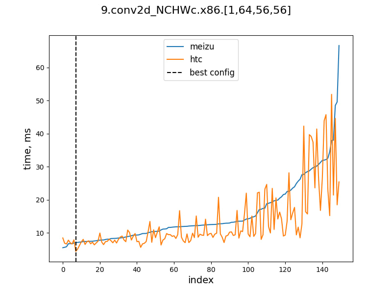
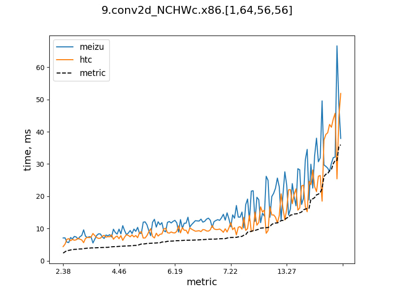

# Ferule
Ferule is a pun that explains the role of this library well. The word for rigor in education "motivating ruler" brings together tools for measuring and comparing performance of neural networks.

A feature of the project is that it uses the functionality of the [TVM](https://github.com/apache/tvm) engine. The library uses an RPC connection to deliver data and take measurements on a mobile device. The following tools are currently available:
* **cross-compile** allows you to tune and get the source object for one device and measure performance of the compiled network on the other;
* **config-overlay** tool to get the best configuration for multiple devices

## Quickstart
Run the following code inside the repository
```console
foo@bar:~$ python -m pip install --upgrade pip build
foo@bar:~$ python -m build --sdist --wheel
foo@bar:~$ python -m pip install . --prefer-binary --force-reinstall --find-links dist/
```
Tools are now available from the command line
```console
foo@bar:~$ cross-compile
Usage: cross-compile [OPTIONS] COMMAND [ARGS]...
```
Also you can use library tools without installation (preferably for changing tuning settings manually)
```console
foo@bar:~$ export PYTHONPATH="${PYTHONPATH}:~/Ferule/src"
foo@bar:~$ python -m ferule.cross_compile
```

## cross-compile
Program for cross-compilation and collection inference statistics. It works in two modes: tune and execute. 

`~$ cross-compile tune` tunes the neural network according to the selected autotuner, compiles the model and measures the run time. Detailed information can be obtained using the `--help` flag.
```console
foo@bar:~$ cross-compile tune atvm mace_mobilenet_v1 -p 9090 -k sd888
```
`~$ cross-compile exec` measure the execution time of source object on the passed device. It can accept JSON obtained as a result of tuning, while additionally compiling 
(specify `--target` and `--target_host` if needed).
```console
foo@bar:~$ cross-compile exec atvm sd888.mace_mobilenet_v1.float32.atvm.so -p 9090 -k kirin710
```
Additionally, there is `~$ cross-compile view` command that displays the path to the folder where models, logs and source objects are saved.

## config-overlay

This command allows you to get the optimal configuration for multiple layers. For this, the formula is used


where  is the number of devices,  is the inference time of the selected configuration on the -th device, and  is the best device time on the current layer.
```console
foo@bar:~$ config-overlay meizu.mace_mobilenet_v1.float32.atvm.json htc.mace_mobilenet_v1.float32.atvm.json -k meizu -k htc -p 9090 --layer 6
```
Executing the command allows you to get logs and the optimal configuration for the specified layers. Graphs for visual evaluation will also be built.
<table class="table table-bordered table-hover table-condensed">
<thead><tr><th title="Field #1">best config</th>
<th title="Field #2">configs sorted by metrics </th>
</tr></thead>
<tbody><tr>
<td></td>
<td></td>
</tr>
</tbody></table>

In the first graph, the best configuration is indicated among all configurations sorted by inference time on the first device. The second plot shows sorted configurations by the previously defined metric.
